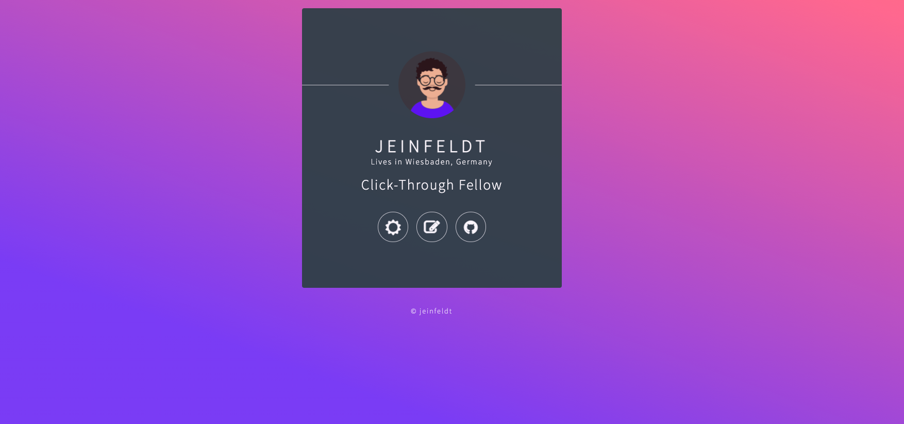

# TL;DR
During a Sunday afternoon in quarantine I decided to give this whole
[Jamstack](https://jamstack.org/) hype a try. As a static site generator
I chose [Hugo](https://gohugo.io/).


***



I wrote a small personal introduction card with randomly
selected job position titles, taken from a [Silicon Valley
Job Title Generator](https://siliconvalleyjobtitlegenerator.tumblr.com/).
Base theme is [hugo-identity-theme](https://themes.gohugo.io/hugo-identity-theme/). 

# Motivation
Well, as of writing this, it is like -5° celcius. Plus a pandemic going on.
So, not many alternatives of leisure time activities.

Plus, I stumbled upon the websites of [@kantholtz](https://kantholtz.de/) and [@tderleth](https://thomasderleth.de/) and want to be part of the club!

# Running
Get yourself Hugo
```bash
brew install hugo
```
And run the local server

```bash
hugo server -D
```

# Open Tasks
* Deploy it somewhere (I want to have a look at [netlify](https://www.netlify.com/))
* Include frontend pipeline for assets
* Sprinkle in some animations (e.g. wink in night mode, animejs)
* Fill in social links
* If motivation really hits provide a Dockerfile

# License
WTFPL license <br>
<a href="http://www.wtfpl.net/"></a>